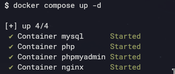
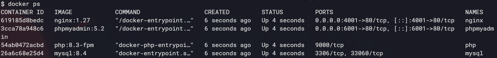
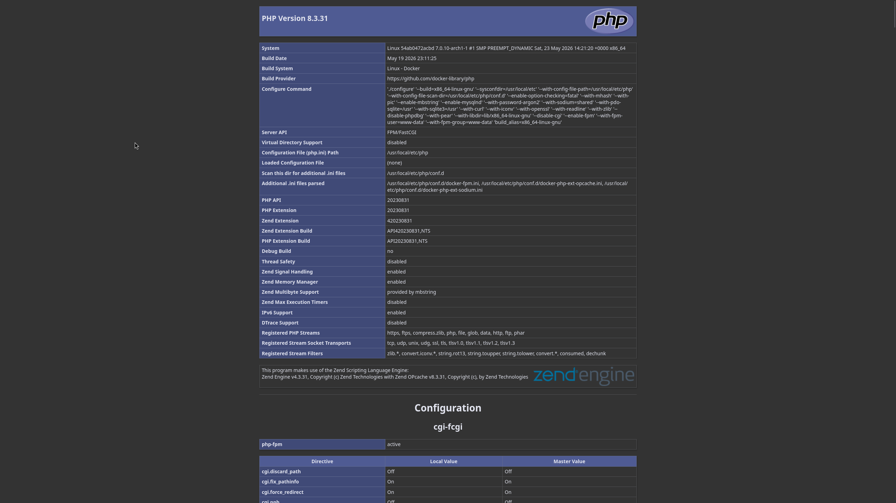
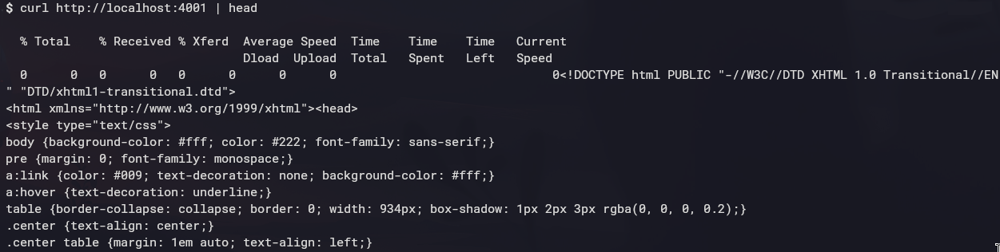
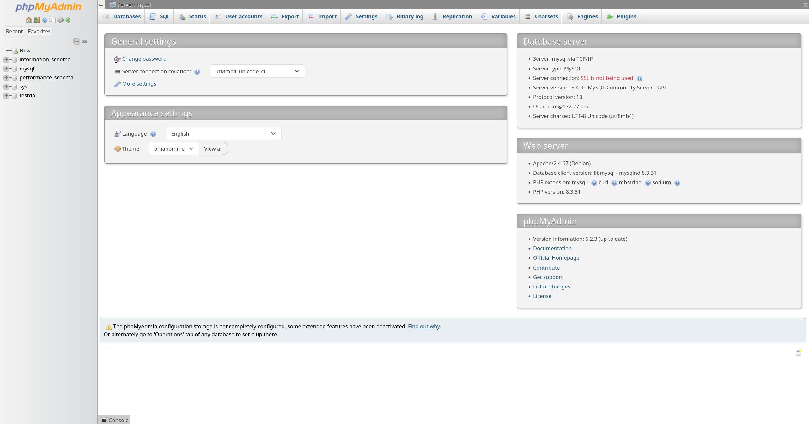
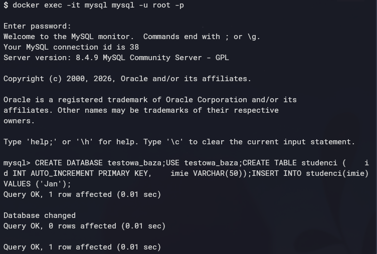
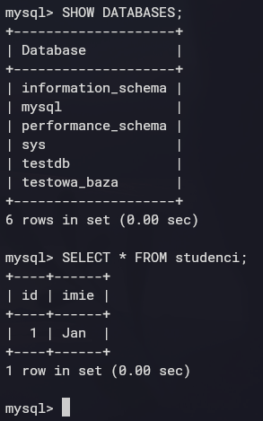
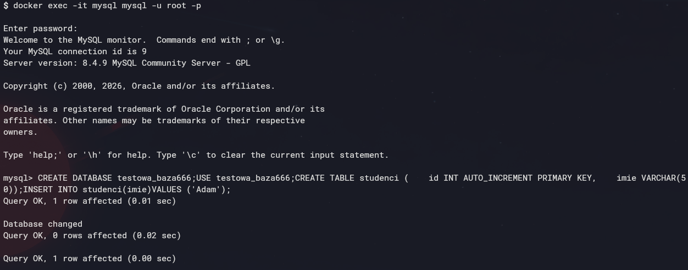
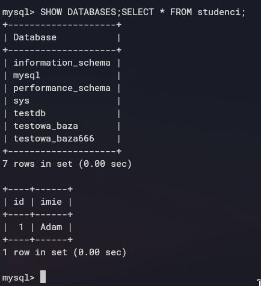

# Lab13 + 13D. Docker Compose, Stack LEMP i phpMyAdmin

# 1. Rozwiązanie wymagań z zadania

## Stack LEMP

Przygotowano środowisko składające się z czterech kontenerów:

- Nginx
- PHP-FPM
- MySQL
- phpMyAdmin

Kontenery uruchamiane są za pomocą pliku docker-compose.yaml.

## Sieci

Utworzono dwie sieci:

- frontend
- backend

### Uzasadnienie podłączenia phpMyAdmin

phpMyAdmin musi być dostępny dla użytkownika przez przeglądarkę, dlatego został podłączony do sieci frontend.

Jednocześnie musi komunikować się z serwerem MySQL, dlatego został również podłączony do sieci backend.

Dzięki temu możliwe jest logowanie do phpMyAdmin z poziomu przeglądarki oraz zarządzanie bazą danych znajdującą się w kontenerze MySQL.

# 2. Struktura katalogów

## Utworzenie katalogów

mkdir -p ~/lab13/nginx
mkdir -p ~/lab13/www
cd ~/lab13

# 3. Przygotowanie pliku PHP

## Utworzenie pliku index.php

cat <<EOF > ~/lab13/www/index.php
<?php
phpinfo();
?>

# 4. Konfiguracja Nginx

## Utworzenie pliku nginx/default.conf

cat <<EOF > ~/lab13/nginx/default.conf
server {
    listen 80;
    server_name localhost;
    root /var/www/html;
    index index.php index.html;
    location / {
        try_files \$uri \$uri/ /index.php?\$query_string;
    }
    location ~ \.php\$ {
        include fastcgi_params;
        fastcgi_pass php:9000;
        fastcgi_index index.php;
        fastcgi_param SCRIPT_FILENAME \$document_root\$fastcgi_script_name;
    }
}

# 5. Utworzenie pliku docker-compose.yaml

services:

  nginx:
    image: nginx:1.27
    container_name: nginx
    ports:
      - "4001:80"
    volumes:
      - ./www:/var/www/html
      - ./nginx/default.conf:/etc/nginx/conf.d/default.conf
    depends_on:
      - php
    networks:
      - frontend
      - backend

  php:
    image: php:8.3-fpm
    container_name: php
    volumes:
      - ./www:/var/www/html
    networks:
      - backend

  mysql:
    image: mysql:8.4
    container_name: mysql
    restart: always
    environment:
      MYSQL_ROOT_PASSWORD: root123
      MYSQL_DATABASE: testdb
    volumes:
      - mysql_data:/var/lib/mysql
    networks:
      - backend

  phpmyadmin:
    image: phpmyadmin:5.2
    container_name: phpmyadmin
    restart: always
    ports:
      - "6001:80"
    environment:
      PMA_HOST: mysql
      MYSQL_ROOT_PASSWORD: root123
    depends_on:
      - mysql
    networks:
      - frontend
      - backend

volumes:
  mysql_data:

networks:
  frontend:
  backend:

# 6. Uruchomienie środowiska

## Start kontenerów

docker compose up -d

## Sprawdzenie działających kontenerów

docker ps

# 7. Weryfikacja działania serwera Nginx + PHP

## Test przez przeglądarkę

Adres:

http://localhost:4001

## Test przez curl

curl http://localhost:4001 | head

# 8. Weryfikacja działania phpMyAdmin

## Wejście do panelu

Adres:

http://localhost:6001

Dane logowania:

Login: root
Hasło: root123

# 9. Utworzenie testowej bazy danych

docker exec -it mysql mysql -u root -p
CREATE DATABASE testowa_baza;
USE testowa_baza;

CREATE TABLE studenci (
    id INT AUTO_INCREMENT PRIMARY KEY,
    imie VARCHAR(50)
);

INSERT INTO studenci(imie)
VALUES ('Jan');

# 10. Potwierdzenie utworzenia bazy

Wyświetlenie baz:

SHOW DATABASES;
SELECT * FROM studenci;

# 11. Użycie secrets (Lab 13D)

Zmodyfikowany dockerfile:
services:

  nginx:
    image: nginx:1.27
    container_name: nginx
    ports:
      - "4001:80"
    volumes:
      - ./www:/var/www/html
      - ./nginx/default.conf:/etc/nginx/conf.d/default.conf
    depends_on:
      - php
    networks:
      - frontend
      - backend

  php:
    image: php:8.3-fpm
    container_name: php
    volumes:
      - ./www:/var/www/html
    networks:
      - backend

  mysql:
    image: mysql:8.4
    container_name: mysql
    restart: always
    environment:
      MYSQL_ROOT_PASSWORD_FILE: /run/secrets/db_root_password
      MYSQL_DATABASE: testdb
    secrets:
      - db_root_password
    volumes:
      - mysql_data:/var/lib/mysql
    networks:
      - backend

  phpmyadmin:
    image: phpmyadmin:5.2
    container_name: phpmyadmin
    restart: always
    ports:
      - "6001:80"
    environment:
      PMA_HOST: mysql
    depends_on:
      - mysql
    networks:
      - frontend
      - backend

secrets:
  db_root_password:
    file: ./secrets/db_root_password.txt

volumes:
  mysql_data:

networks:
  frontend:
  backend:

Utworzenie sekretów:

cd secrets
echo "root123" > db_root_password.txt

# 12. Utworzenie testowej bazy danych

docker exec -it mysql mysql -u root -p
CREATE DATABASE testowa_baza666;
USE testowa_baza666;

CREATE TABLE studenci (
    id INT AUTO_INCREMENT PRIMARY KEY,
    imie VARCHAR(50)
);

INSERT INTO studenci(imie)
VALUES ('Adam');

# 13. Potwierdzenie utworzenia bazy

Wyświetlenie baz:

SHOW DATABASES;
SELECT * FROM studenci;

